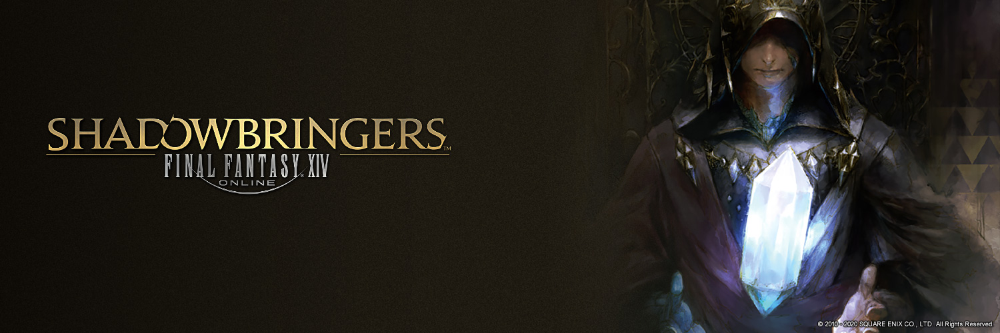

# FFXIV Skill Rotations Simulator

## Overview
### FINAL FANTASY XIV(FFXIV)・スキル回しシミュレーター
FFXIVをもっと楽しむために学びたい、スキル回しを直感的に組み立てられるアプリです。 最新パッチの計算式を元に、DPSを概算できます。楽しく直感的に今よりもうまくなろう！

現在学習中・製作中の初学者です。以下は全て予定ですが、必ずやります（断言

Create original rotations.  Calculate by latest formula.   This makes you more fun! Just started, everything is just plans, but I will get it done. I'm not good at English, please let me know if it is difficult for you understand.

## Features
- **ステータス入力**Add status of your character
- **スキル回し構築**Create skill rotations with simple controls
- **トッププレイヤーのスキル回しテンプレート**Check top players rotations
- **ジョブ毎のスキル回し保存機能**Save yours per jobs

## Download

## Story
数多くのスキルやアビリティを適切な順番で使用して、より効率的に高いダメージを出すことは、 気軽に遊びたいプレイヤーにはハードルが高いものだと考えます。 気軽に「より上手く」を目指すことができれば、FFXIVをもっと楽しめるようになるという想いから、製作を決意しました。

It's so hard to construct the best skill rotations for casual users. I want to lower the hurdle of learning rotations. I believe if app like that exists, makes lots of players fun. So I determined to create that.

## Requirements Document

課題*assignment*|なぜ解決したいか*why I want to solve*|解決のための実装*features/functions*
---|---|---
実プレイ時間の確保*keep time for play*|限られたプレイ時間を極力長く保ちたい*learn until log in, use time for play*|シンプルなUIで直感的にスキル回しを考えられる*simple controls*
情報の多さ*flood of info*|簡単にスキル回しを勉強したい*for learn easily*|トッププレイヤーのスキル回しをテンプレートとして用意*can check top player's one*
PS4・PS5ユーザーの勉強しづらさ*barrier between PS and PC*|障壁になるものを減らしたい*for decrease barrier*|DPSを概算してリアルタイムで表示*calculate DPS*
かといってゲーム外ではそもそものコンボが分からない。。*Actually I don't remember combos...*|調査を必要とすると手軽さがなくなる*stop necessity of investigation*|次に使えるスキルやアビリティなどをリキャストタイムやバフから割り出す*buff, recast management system...?*
実力への反映*effect actual user skill*|机上論で終わらせたくない*for not finish in impractical proposition*|木人での練習時などに、1GCD前倒しで読み上げてくれる機能*reading aloud the skill in advance*

